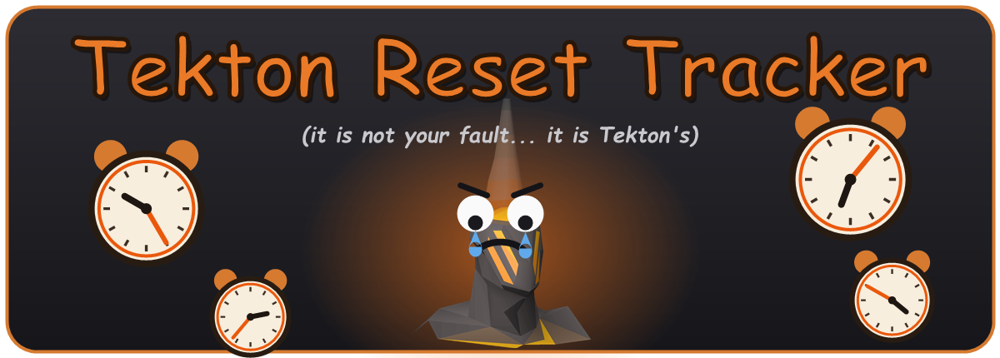

<div align="center">



**Counts how often you reset a Chambers of Xeric Challenge Mode raid at Tekton — and the time you burn doing it.**

[](https://runelite.net/)
[](https://adoptium.net/temurin/releases/?version=11)
[](LICENSE)
[](https://oldschool.runescape.wiki/w/Chambers_of_Xeric/Challenge_Mode)

</div>

---

## ✨ Features

| | |
|---|---|
| 🧮 **Lifetime stats** | Total resets and total time wasted, persisted across client restarts. |
| 🕒 **Session stats** | Resets and time wasted since you launched the client. |
| 📍 **Live raid status** | Shows whether you're in a CM raid (and the running timer) or a Normal raid (not tracked). |
| 💬 **Chat feedback** | Optional game message on each reset with the count and time wasted. |
| 📋 **Copy & reset** | One click to copy your stats to the clipboard, one to wipe them. |
| 🎯 **CM-only** | Normal raids are ignored entirely — only Challenge Mode counts. |

No overlay, no infobox — everything lives in the **side panel** (Tektiny icon in the
right-hand toolbar).

## 🧠 What counts as a reset?

A reset is recorded when **all** of these are true for a single raid:

| Condition | Why |
|---|---|
| ✅ The raid is **Challenge Mode** | Normal raids are ignored. |
| ✅ You reached the **Tekton room** | A Tekton NPC appeared in the scene. |
| ✅ You **did not kill** Tekton | The raid ended / you left with him still alive. |

```
Entered CM raid ──▶ Saw Tekton? ──no──▶ (nothing counted)
                         │
                        yes
                         │
                 Killed Tekton? ──yes──▶ (progressed — nothing counted)
                         │
                         no
                         │
              Raid ended / you left ──▶ ⚔️  RESET +1  (+ time wasted)
```

**Not counted:** killing Tekton (even if you leave later), Normal-mode raids, and
logging out or world-hopping mid-raid (the raid persists server-side — tracking
just resumes when you log back in).

## 🖥️ The panel

```
┌─────────────────────────────┐
│  Tekton Reset Tracker        │
│  Challenge Mode only         │
│                              │
│  All-time                    │
│    Resets            12      │
│    Time wasted     8:30      │
│                              │
│  This session                │
│    Resets             3      │
│    Time wasted     2:15      │
│                              │
│  Current raid                │
│    Status   CM raid — 0:42   │
│                              │
│   [ Reset ]   [ Copy stats ] │
└─────────────────────────────┘
```

## ⚙️ Configuration

Open the plugin's settings (the gear icon next to it in the plugin list):

| Setting | Default | Description |
|---|---|---|
| **Chat message on reset** | On | Print a game message with your reset count and time wasted whenever a reset is recorded. |

## 🚀 Install (Plugin Hub)

Once published, search **"Tekton Reset Tracker"** in RuneLite's **Plugin Hub** and
click install. No setup required.

## 🛠️ Build & run from source

You need **JDK 11**. Point `JAVA_HOME` at it and use the Gradle wrapper from the
project root.

<details>
<summary><strong>Windows (PowerShell)</strong></summary>

```powershell
cd C:\path\to\TektonResetTracker
$env:JAVA_HOME = "C:\Program Files\Eclipse Adoptium\jdk-11.0.31.11-hotspot\"
.\gradlew.bat run
```
</details>

<details>
<summary><strong>macOS / Linux</strong></summary>

```bash
export JAVA_HOME=/path/to/jdk-11
./gradlew run
```
</details>

| Command | Does |
|---|---|
| `gradlew run` | Launch RuneLite (developer mode) with the plugin loaded. |
| `gradlew build` | Compile and run the unit tests. |
| `gradlew shadowJar` | Build the shaded jar the Plugin Hub publishes. |

## 🔍 How it works

- **In a raid:** detected via the `IN_RAID` varbit.
- **Challenge Mode:** detected via the `RAIDS_CHALLENGE_MODE` varbit, latched while
  you're inside the raid (it clears the instant you leave).
- **Tekton room:** detected when any Tekton NPC spawns in the scene (all of his
  states — waiting, walking, fighting, hammering, enraged).
- **A kill:** detected when a Tekton NPC despawns *while dead*. Walking out of the
  room or his standard→enraged swap despawn him **without** the death flag, so they
  don't count as progress.
- **Time wasted:** wall-clock time from entering the raid to the reset.

## 📦 Publishing to the Plugin Hub

1. Push this project to a **public GitHub repository**.
2. Fork [runelite/plugin-hub](https://github.com/runelite/plugin-hub).
3. Add a file named `plugins/tekton-reset-tracker` (no extension) containing:
   ```
   repository=https://github.com/<your-username>/<your-repo>.git
   commit=<full 40-character commit hash you want published>
   ```
4. Open a pull request against `runelite/plugin-hub` and wait for review.

See the [Plugin Hub guide](https://github.com/runelite/plugin-hub) for the full
rules (icon, naming, and review requirements).

## 📜 License

Released under the [BSD 2-Clause License](LICENSE).

The icon is the in-game **Tektiny** pet sprite, © Jagex Ltd — used here for a
fan-made plugin and not affiliated with or endorsed by Jagex.
